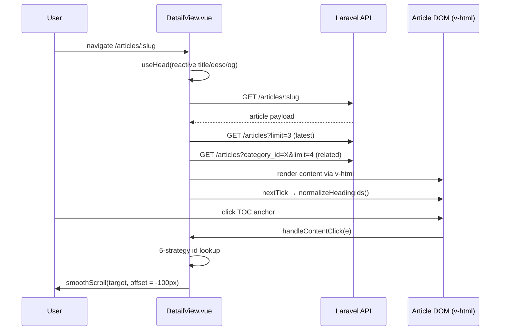

# Design Document: Article Detail Redesign

## Overview

Redesign halaman Article Detail (`frontend/src/views/articles/DetailView.vue`) agar tampil lebih profesional dan konsisten dengan brand PT Cakrawala Parama Internasional. Sistem visual bergeser dari palet single-orange ke pasangan **red-600 primary / orange-600 secondary**, dengan tipografi dual-family: **Montserrat** untuk heading dan **Quicksand** untuk body & meta. Seluruh perilaku non-visual (SEO `useHead`, i18n locale, fetch detail/latest/related, TOC click handler, normalisasi heading id, smooth scroll offset −100px, image fallback, date formatting) dipertahankan persis.

Perubahan terbatas pada tiga file: `index.html` (perbaikan link Google Fonts agar Quicksand benar-benar ter-load), `src/style.css` (registrasi token `--font-quicksand` dan alias warna brand di `@theme`), serta `DetailView.vue` (template class + scoped style). Tidak ada perubahan API, store, router, atau script logic.

---

## Architecture

Susunan komponen tidak berubah; hanya layer styling, font tokens, dan link Google Fonts yang disentuh.

```mermaid
graph TD
    A[index.html<br/>Google Fonts link] --> B[src/style.css<br/>@theme tokens]
    B --> C[DetailView.vue]
    C --> D[Navbar]
    C --> E[Main Article Column<br/>lg:w-2/3]
    C --> F[Sticky Sidebar<br/>lg:w-1/3]
    C --> G[Related Articles Grid]

    E --> E1[Category Badge<br/>red-50 / red-600]
    E --> E2[Hero Title<br/>Montserrat 800]
    E --> E3[Meta Row<br/>red-500 icons + Quicksand]
    E --> E4[Featured Image]
    E --> E5[Article Body Card<br/>prose + :deep styles]
    E --> E6[TOC Container<br/>div.bg-slate-50]

    F --> F1[Latest Articles List]
    F --> F2[CTA Card<br/>red-600 → orange-600 gradient]
```

### Main Workflow



---

## Components and Interfaces

### DetailView.vue

**Purpose**: Render satu artikel dengan editorial styling, sticky sidebar, dan related articles. Single-File Component, no new sub-components introduced.

**Public Contract** (unchanged):

```typescript
// Route binding
interface RouteParams {
  slug: string
}

// Reactive state
interface DetailViewState {
  article: Ref<Article | null>
  latestArticles: Ref<Article[]>
  relatedArticles: Ref<Article[]>
  isLoading: Ref<boolean>
}

// Computed (consumed by useHead)
interface SeoComputed {
  articleTitle: ComputedRef<string>   // "<title> - Cakrawala"
  articleDesc: ComputedRef<string>    // short_description | excerpt | fallback
  articleImage: ComputedRef<string>   // resolved image url or ''
  currentUrl: ComputedRef<string>     // window.location.href or ''
}

// Behaviors (unchanged signatures)
function fetchDetail(slug: string): Promise<void>
function fetchLatest(): Promise<void>
function fetchRelated(categoryId: number, currentArticleId: number): Promise<void>
function formatDate(dateString: string): string
function generateIdFromText(text: string): string
function normalizeHeadingIds(): void
function handleContentClick(e: MouseEvent): void
```

**Visual Responsibilities** (changed):
- Apply **red-600** as primary accent: category badge, heading underline, blockquote left border, sidebar accent bar, related accent bar, CTA button text.
- Apply **orange-600** as secondary accent: prose link color, link hover, gradient end-stop on CTA, meta-row icon hover.
- Apply **Montserrat** to all heading-class elements (h1–h4, sidebar/related section labels, button labels, eyebrows).
- Apply **Quicksand** to body copy, meta row, descriptions, sidebar card titles.
- Tighten card treatment: hairline borders, soft red-tinted shadows on hover, refined spacing.

### Sub-blocks (style-only; no template restructure)

| Sub-block | DOM tag/class root | Style change summary |
|-----------|--------------------|----------------------|
| Loading skeleton | `div.space-y-6` | Unchanged (neutral slate). |
| Category badge | `span.inline-block` | `bg-orange-50 text-orange-600` → `bg-red-50 text-red-600`, add `font-montserrat`. |
| Hero title | `h1` | Add `font-montserrat tracking-tight`. |
| Meta row | `div.flex.flex-wrap` | Add `font-quicksand`, icons `text-orange-400` → `text-red-500`, text `slate-400` → `slate-500` (AA). |
| Share buttons | `button.share-btn` | Pink/blue → red/orange brand pair, add `font-montserrat`, add focus ring. |
| Featured image | `div.rounded-2xl` | Hover shadow tint `shadow-red-100/50`. |
| Article body | `article.article-body` | Add `font-quicksand` baseline; `:deep(h2)` underline `red-100`; `:deep(blockquote)` accent `red-600` on `red-50`; prose links stay `orange-600`. |
| TOC container | `div.bg-slate-50` (inside v-html) | **Selector preserved verbatim** — required by `normalizeHeadingIds`. |
| Latest articles list | `div.flex.flex-col.gap-4` | Accent bar red-600, hover bg `red-50`, hover border `red-100`. |
| CTA card | `div.bg-gradient-to-br` | Gradient `from-orange-500 to-orange-600` → `from-red-600 via-red-600 to-orange-600`. |
| Related grid | `div.grid` | Hover shadow `shadow-red-100/50`, eyebrow `text-red-600`, title hover `text-red-600`. |

---

## Data Models

No data model changes. The component consumes the existing API shape:

```typescript
interface Article {
  id: number
  slug: string
  title: string
  title_en: string | null
  short_description: string | null
  short_description_en: string | null
  excerpt?: string | null
  content: string                    // HTML, rendered via v-html
  content_en: string | null
  image: string | null
  total_view: number
  created_at: string                 // ISO 8601
  category_id: number | null
  category: Category | null
  author: { name: string } | null
}

interface Category {
  id: number
  name: string
  name_en: string | null
}
```

**Validation Rules**:
- `slug` is non-empty when present in route.
- `content` (or `content_en` when locale = 'en') is HTML produced by the trusted backend (TipTap editor) — rendered via `v-html`.
- `image` may be null → `getImageUrl` + `handleImageError` provide a fallback.
- Locale-aware fields (`title_en`, `content_en`, `category.name_en`) fall back to non-suffixed sibling when null.

---

## Visual Design System

### Color Tokens

Built on Tailwind's stock `red` and `orange` scales. Tailwind v4 already exposes these as CSS variables (`--color-red-600`, `--color-orange-600`); the `@theme` block adds semantic aliases for self-documenting class names.

| Role | Tailwind class | Hex | Usage |
|------|----------------|-----|-------|
| Primary | `red-600` | `#dc2626` | Category badge text, h2 underline (light), blockquote border, sidebar accent bar, related accent bar, CTA button label |
| Primary hover | `red-700` | `#b91c1c` | Active CTA hover, strong-tag emphasis |
| Primary tint | `red-50` | `#fef2f2` | Badge bg, blockquote bg, sidebar item hover bg |
| Primary border | `red-100` | `#fee2e2` | h2 underline, sidebar item hover border, soft shadow |
| Secondary | `orange-600` | `#ea580c` | Prose link color, link hover underline, CTA gradient end-stop |
| Secondary hover | `orange-700` | `#c2410c` | Hover on share-fb button |
| Secondary tint | `orange-50` | `#fff7ed` | Hover on share-fb button bg |
| Heading ink | `slate-900` | `#0f172a` | h1, h2 |
| Body | `slate-700` | `#334155` | Prose body |
| Muted | `slate-500` | `#64748b` | Meta row (upgraded from `slate-400` for AA) |
| Hairline | `slate-100` | `#f1f5f9` | Card borders, dividers |
| Surface | `white` | `#ffffff` | Card bg |
| Subtle surface | `slate-50` | `#f8fafc` | Sidebar item bg (resting) |

Semantic aliases registered in `@theme` (optional but recommended):

```css
@theme {
  --color-primary:         var(--color-red-600);
  --color-primary-hover:   var(--color-red-700);
  --color-secondary:       var(--color-orange-600);
  --color-secondary-hover: var(--color-orange-700);
}
```

### Typography Scale

| Element | Size (mobile → md) | Weight | Family | Tracking |
|---------|-------------------|--------|--------|----------|
| Hero title (h1) | `text-2xl sm:text-3xl md:text-4xl` | 800 | Montserrat | `tracking-tight` |
| Section heading (h2) | `text-2xl` | 800 | Montserrat | normal |
| Sub-heading (h3) | `text-xl` | 700 | Montserrat | normal |
| Sub-sub-heading (h4) | `text-lg` | 700 | Montserrat | normal |
| Sidebar/related label | `text-sm` | 700 | Montserrat | `tracking-widest uppercase` |
| Eyebrow / category | `text-[11px]` | 700 | Montserrat | `tracking-widest uppercase` |
| Body paragraph | `text-base` (prose-lg) | 400 | Quicksand | normal, `line-height: 1.8` |
| Meta row | `text-xs` | 500 | Quicksand | normal |
| Sidebar card title | `text-sm` | 600 | Quicksand | normal |
| Button label | `text-xs` | 700 | Montserrat | `tracking-wider uppercase` |

### Spacing & Card Treatment

- Page max-width `max-w-6xl`, gutter `px-4 sm:px-6`, vertical rhythm `py-10 md:py-16` (unchanged).
- Article column gaps: badge → title `mb-6`, title → meta `mb-8`, meta → image `mb-10`, image → body `mb-10` (unchanged).
- Card radius `rounded-2xl`; sidebar items `rounded-xl`; badges `rounded-full`.
- Resting border `border border-slate-100`; hover `shadow-xl shadow-red-100/50`.
- Sticky sidebar `sticky top-24 space-y-8` (unchanged).

---

## Font Loading Strategy

### Problem

Current `index.html` declares one `<link>` element with **three duplicate `href` attributes**. HTML parsers honor only the first attribute, so only Inter actually loads — Montserrat, Poppins, and Quicksand are silently missing.

```html
<!-- Current (broken) -->
<link
  href="https://fonts.googleapis.com/css2?family=Inter:wght@300;400;500;600;700&display=swap"
  rel="stylesheet"
  href="...Inter+Montserrat+Poppins..."
  rel="stylesheet"
  href="...Inter+Montserrat+Poppins+Quicksand..."
  rel="stylesheet"
/>
<!-- Effect: only Inter loads -->
```

### Fix — Single combined Google Fonts request

Replace the malformed block with **one** well-formed `<link>` requesting all four families in a single HTTP round-trip:

```html
<link rel="preconnect" href="https://fonts.googleapis.com" />
<link rel="preconnect" href="https://fonts.gstatic.com" crossorigin />
<link
  rel="stylesheet"
  href="https://fonts.googleapis.com/css2?family=Inter:wght@300;400;500;600;700&family=Montserrat:ital,wght@0,300..900;1,300..900&family=Poppins:wght@300;400;500;600;700&family=Quicksand:wght@400;500;600;700&display=swap"
/>
```

Rationale:
- **One request** instead of three → fewer round-trips, faster first paint of branded type.
- `display=swap` → text remains visible during font load (FOUT, not FOIT). Honors AA on text-visibility timing.
- Quicksand subset limited to weights `400;500;600;700` (no italic) → ~25–35 KB woff2 total.
- `preconnect` is already present and reused.

### Tailwind v4 Token Registration

Update `src/style.css` `@theme` block so utility classes (`font-quicksand`, `text-primary`, etc.) resolve:

```css
@import "tailwindcss";

@theme {
  --color-brand: oklch(57.7% 0.245 27.325);

  --font-sans:       "Inter", ui-sans-serif, system-ui, sans-serif;
  --font-montserrat: "Montserrat", sans-serif;
  --font-poppins:    "Poppins", sans-serif;
  --font-quicksand:  "Quicksand", "Montserrat", sans-serif;   /* NEW — Quicksand with Montserrat fallback */

  --color-primary:         var(--color-red-600);              /* NEW */
  --color-primary-hover:   var(--color-red-700);              /* NEW */
  --color-secondary:       var(--color-orange-600);           /* NEW */
  --color-secondary-hover: var(--color-orange-700);           /* NEW */
}
```

Existing `red-*` / `orange-*` classes remain valid; tokens are additive.

---

## Algorithmic Pseudocode (Behavior Preservation)

The script section of `DetailView.vue` is **unchanged**. The algorithms below are restated to lock down the contracts the redesign must not regress.

### `normalizeHeadingIds()`

```pascal
ALGORITHM normalizeHeadingIds()
INPUT:  none (reads document)
OUTPUT: side effect — assigns `id` to <h2>/<h3>/<h4> inside <article>

PRECONDITIONS:
  - `<article>` exists in DOM
  - article.content is rendered via v-html (call from nextTick)
POSTCONDITIONS:
  - Every TOC link href="#X" has a heading with id="X" reachable
  - Every heading has a non-empty id (generated as fallback)

BEGIN
  articleEl ← document.querySelector('article')
  IF articleEl = null THEN RETURN

  headings ← Array.from(articleEl.querySelectorAll('h2, h3, h4'))
  IF headings.length = 0 THEN RETURN

  tocContainer ← articleEl.querySelector('div.bg-slate-50')   // ← MUST stay 'bg-slate-50'
  IF tocContainer = null THEN
    FOR each (h, idx) IN headings DO
      IF h.id is empty THEN
        h.id ← generateIdFromText(h.textContent) OR ('h-' + idx)
      END IF
    END FOR
    RETURN
  END IF

  tocLinks ← Array.from(tocContainer.querySelectorAll('a[href^="#"]'))
  IF tocLinks.length = 0 THEN RETURN

  used ← empty Set
  FOR each link IN tocLinks DO
    expectedId ← link.getAttribute('href').substring(1)
    linkText   ← link.textContent.trim().toLowerCase()

    matched ← findHeading(headings, used, byExactText(linkText))
           OR findHeading(headings, used, byContains(linkText))
           OR findHeading(headings, used, byContainedIn(linkText))
           OR findHeading(headings, used, anyUnused)

    IF matched ≠ null THEN
      used.add(headings.indexOf(matched))
      matched.id ← expectedId
    END IF
  END FOR

  // Fallback: any heading still without id gets one from its text
  FOR each (h, idx) IN headings DO
    IF NOT used.has(idx) AND h.id is empty THEN
      h.id ← generateIdFromText(h.textContent) OR ('h-' + idx)
    END IF
  END FOR
END
```

**Loop invariants**:
- After iteration `i` of the TOC loop, every heading in `used` has an `id` exactly matching some processed TOC link's target.
- After the fallback loop, every heading has a non-empty `id`.

### `handleContentClick(e)`

```pascal
ALGORITHM handleContentClick(e)
INPUT:  MouseEvent e
OUTPUT: side effect — smooth scroll, history.replaceState

PRECONDITIONS:
  - e.target is inside <article> when triggered by template
  - normalizeHeadingIds() has run for this article
POSTCONDITIONS:
  - If a matching heading is found: window scrolls to (top - 100px), URL hash updated
  - If no match: no scroll, no navigation, console.error logged
  - In all cases: e.preventDefault() honored — no full-page navigation

BEGIN
  target ← e.target.closest('a')
  IF target = null THEN RETURN

  href ← target.getAttribute('href')
  IF href = null THEN RETURN

  isHashLink  ← href contains '#'
  isLocalLink ← href starts with '#' OR '.' OR not contains '://'
  IF NOT (isHashLink AND isLocalLink) THEN RETURN

  e.preventDefault()
  e.stopPropagation()

  hash ← href.substring(href.indexOf('#'))
  id   ← decodeURIComponent(hash.substring(1))
  IF id is empty THEN RETURN

  // 5-strategy lookup
  el ← document.getElementById(id)
  IF el = null THEN el ← document.querySelector('[name="' + id + '"]')
  IF el = null AND id matches /^section-\d+$/i THEN
    headings ← document.querySelectorAll('article h2, article h3, article h4')
    el ← headings[parseInt(id.match(/\d+$/)[0])]
    IF el ≠ null THEN el.id ← id
  END IF
  IF el = null THEN
    headings ← document.querySelectorAll('article h2, article h3, article h4')
    FOR each h IN headings DO
      IF generateIdFromText(h.textContent) = id THEN el ← h; BREAK
    END FOR
  END IF
  IF el = null THEN
    keywords ← id.split('-').filter(w → w.length > 2)
    IF keywords.length > 0 THEN
      FOR each h IN headings DO
        IF every kw IN keywords appears in h.textContent.toLowerCase() THEN
          el ← h; BREAK
        END IF
      END FOR
    END IF
  END IF

  IF el ≠ null THEN
    yOffset    ← -100                                            // navbar offset
    targetPos  ← el.getBoundingClientRect().top + window.scrollY
    finalPos   ← max(0, targetPos + yOffset)
    setTimeout(0, () → window.scrollTo({ top: finalPos, behavior: 'smooth' }))
    window.history.replaceState(null, '', hash)
  ELSE
    console.error('TOC: target not found for #' + id)
  END IF
END
```

**Postcondition guarantee**: regardless of strategy, the user never lands on a blank page; the worst case is a logged error and no scroll.

---

## Key Functions with Formal Specifications

### `fetchDetail(slug: string): Promise<void>`

**Preconditions**: `slug` is a non-empty string from `route.params.slug`.

**Postconditions**:
- On success: `article.value` is populated, `latestArticles` and `relatedArticles` are triggered, `isLoading` returns to `false`, `normalizeHeadingIds()` is queued via `nextTick`.
- On failure: `router.push({ name: 'NotFound' })` fires, `isLoading` returns to `false`.

**Loop invariants**: N/A.

### `formatDate(dateString: string): string`

**Preconditions**: `dateString` is either a valid ISO 8601 date or null/undefined.

**Postconditions**:
- Returns `'-'` if `dateString` is falsy.
- Returns localized date in `id-ID` when `locale.value !== 'en'`, else `en-US`.
- Format: `{ day: 'numeric', month: 'long', year: 'numeric' }`.
- Pure function — no side effects.

### `useHead(...)` (reactive SEO)

**Preconditions**: `articleTitle`, `articleDesc`, `articleImage`, `currentUrl` are computed refs.

**Postconditions**:
- `<title>` always reflects the current `articleTitle.value`.
- All OG and Twitter meta tags update automatically when `locale` toggles.
- No imperative `document.title = …` calls.

---

## Example Usage (Vue Template Snippets)

### Hero Section (template)

```vue
<!-- Category Badge -->
<span
  v-if="article.category"
  class="inline-block px-4 py-1.5 bg-red-50 text-red-600 text-[11px]
         font-montserrat font-bold uppercase tracking-widest rounded-full mb-6"
>
  {{ locale === 'en' && article.category?.name_en
       ? article.category.name_en
       : article.category?.name }}
</span>

<!-- Hero Title -->
<h1
  class="font-montserrat text-2xl sm:text-3xl md:text-4xl font-extrabold
         text-slate-900 leading-snug tracking-tight mb-6"
>
  {{ locale === 'en' && article.title_en ? article.title_en : article.title }}
</h1>

<!-- Meta Row -->
<div
  class="flex flex-wrap items-center gap-4 mb-8 text-xs text-slate-500
         font-quicksand font-medium"
>
  <div class="flex items-center gap-2">
    <svg class="w-4 h-4 text-red-500" ...></svg>
    <span>{{ formatDate(article.created_at) }}</span>
  </div>
  <!-- ... -->
  <div class="ml-auto flex items-center gap-2">
    <span class="font-montserrat text-[10px] font-bold uppercase
                 tracking-wider text-slate-400">Share</span>
    <button
      class="share-btn font-montserrat text-red-600 hover:bg-red-50
             hover:border-red-200 focus-visible:ring-2
             focus-visible:ring-red-500 focus-visible:ring-offset-2"
      aria-label="Share to Instagram"
    >IG</button>
    <button
      class="share-btn font-montserrat text-orange-600 hover:bg-orange-50
             hover:border-orange-200 focus-visible:ring-2
             focus-visible:ring-orange-500 focus-visible:ring-offset-2"
      aria-label="Share to Facebook"
    >FB</button>
  </div>
</div>
```

### Article Body Card (template)

```vue
<article
  @click="handleContentClick"
  class="article-body font-quicksand rounded-2xl border border-slate-100
         bg-white p-6 sm:p-8 md:p-10 text-slate-700
         prose prose-slate prose-lg max-w-none
         prose-a:text-orange-600 prose-a:no-underline hover:prose-a:underline
         prose-img:rounded-xl"
  v-html="locale === 'en' && article.content_en
            ? article.content_en
            : article.content"
></article>
```

### Article Body — `:deep()` Scoped CSS

```css
/* Heading family preserved */
.article-body :deep(h2) {
  font-family: 'Montserrat', sans-serif;
  font-weight: 800;
  font-size: 1.5rem;
  line-height: 1.35;
  color: #0f172a;
  margin-top: 2.25rem;
  margin-bottom: 1rem;
  padding-bottom: 0.5rem;
  border-bottom: 2px solid var(--color-red-100); /* was orange-200 (#fed7aa) */
}

.article-body :deep(h3),
.article-body :deep(h4) {
  font-family: 'Montserrat', sans-serif;
  /* sizes/weights unchanged */
}

/* Body family — Quicksand */
.article-body :deep(p),
.article-body :deep(li) {
  font-family: 'Quicksand', sans-serif;
  line-height: 1.8;
}

/* Blockquote — red accent on red-50 tint */
.article-body :deep(blockquote) {
  font-family: 'Quicksand', sans-serif;
  border-left: 4px solid var(--color-red-600);  /* was orange-600 #ea580c */
  background: var(--color-red-50);              /* was orange-50  #fff7ed */
  color: #7f1d1d;                                /* red-900 — replaces #9a3412 */
  padding: 0.75rem 1.25rem;
  margin: 1.5rem 0;
  border-radius: 0 0.5rem 0.5rem 0;
  font-style: italic;
}

/* Editorial emphasis */
.article-body :deep(strong) {
  color: var(--color-red-700);
}

/* Anchor color is handled by Tailwind utility prose-a:text-orange-600 */
```

### Sidebar — Latest Articles + CTA Card

```vue
<aside class="lg:w-1/3">
  <div class="sticky top-24 space-y-8">
    <!-- Latest Articles -->
    <section>
      <h2 class="font-montserrat text-sm font-bold text-slate-900
                 uppercase tracking-widest mb-5 flex items-center gap-2">
        <span class="w-6 h-0.5 bg-red-600 rounded-full"></span>
        {{ locale === 'en' ? 'Latest Articles' : 'Artikel Terbaru' }}
      </h2>

      <div class="flex flex-col gap-4">
        <router-link
          v-for="lat in latestArticles" :key="lat.id"
          :to="`/articles/${lat.slug}`"
          class="group flex gap-4 p-3 rounded-xl bg-slate-50
                 hover:bg-red-50 border border-transparent hover:border-red-100
                 transition-all duration-200
                 focus-visible:ring-2 focus-visible:ring-red-500 focus-visible:ring-offset-2"
        >
          <div class="w-20 h-16 flex-shrink-0 overflow-hidden rounded-lg">
            
          </div>
          <div class="flex flex-col justify-center min-w-0">
            <span class="font-montserrat text-[10px] font-bold text-red-600
                         uppercase tracking-wider mb-1">
              {{ locale === 'en' && lat.category?.name_en
                   ? lat.category?.name_en : lat.category?.name }}
            </span>
            <h3 class="font-quicksand text-sm font-semibold text-slate-800
                       line-clamp-2 leading-snug
                       group-hover:text-red-600 transition-colors duration-200">
              {{ locale === 'en' && lat.title_en ? lat.title_en : lat.title }}
            </h3>
          </div>
        </router-link>
      </div>
    </section>

    <!-- CTA Card — red→orange gradient -->
    <section
      class="relative overflow-hidden rounded-2xl
             bg-gradient-to-br from-red-600 via-red-600 to-orange-600
             p-7 text-white"
    >
      <div class="absolute -top-8 -right-8 w-28 h-28 bg-white/10 rounded-full"></div>
      <div class="absolute -bottom-6 -left-6 w-20 h-20 bg-white/10 rounded-full"></div>
      <h4 class="font-montserrat text-lg font-extrabold mb-2 relative z-10">
        {{ locale === 'en' ? 'Need Help?' : 'Butuh Bantuan?' }}
      </h4>
      <p class="font-quicksand text-red-50/90 text-sm mb-5 relative z-10">
        {{ locale === 'en'
             ? 'Contact our team for a free consultation.'
             : 'Hubungi tim kami untuk konsultasi gratis.' }}
      </p>
      <button
        class="relative z-10 w-full bg-white text-red-600 py-3 rounded-xl
               font-montserrat font-bold text-xs uppercase tracking-wider
               hover:bg-red-50 hover:text-red-700 hover:shadow-lg
               transition-all duration-200
               focus-visible:ring-2 focus-visible:ring-white
               focus-visible:ring-offset-2 focus-visible:ring-offset-red-600"
      >
        {{ locale === 'en' ? 'Start Now' : 'Mulai Sekarang' }}
      </button>
    </section>
  </div>
</aside>
```

### Loading Skeleton (unchanged structure, neutral palette retained)

```vue
<div v-if="isLoading" class="space-y-6" aria-busy="true" aria-live="polite">
  <div class="h-8  bg-slate-100 rounded-lg w-2/3 animate-pulse"></div>
  <div class="h-5  bg-slate-100 rounded-lg w-1/3 animate-pulse"></div>
  <div class="h-80 bg-slate-100 rounded-2xl animate-pulse"></div>
  <div class="h-48 bg-slate-100 rounded-2xl animate-pulse"></div>
</div>
```

---

## Correctness Properties

These properties must hold after the redesign. They are stated as universal assertions and verifiable by manual inspection, DOM testing, or contrast tooling.

### Property 1: SEO_PRESERVED

```typescript
// ∀ article a, locale l :
//   document.title === (l === 'en' && a.title_en ? a.title_en : a.title) + ' - Cakrawala'
// ∧ meta[og:title].content      === document.title
// ∧ meta[og:description].content !== ''
// ∧ meta[og:image].content      === resolved image url (or '' when no image)
// ∧ meta[twitter:card].content  === 'summary_large_image'
```

### Property 2: I18N_LOCALE_SWITCH

```typescript
// ∀ rendered text t on the page :
//   t derives from one of {title, title_en, short_description, short_description_en,
//                          content, content_en, category.name, category.name_en}
// ∧ the choice respects locale.value (with English fallback to base when *_en is null)
// ∧ formatDate(d) uses 'en-US' when locale === 'en', else 'id-ID'
```

### Property 3: TOC_NAVIGATION_WORKS

```typescript
// ∀ TOC link L with href = '#X' :
//   click(L) ⟹ smooth scroll to element where (id === 'X' || resolvable via 5-strategy fallback)
// ∧ scrollY === target.getBoundingClientRect().top + window.scrollY − 100
// ∧ no full-page navigation (e.preventDefault honored)
// ∧ window.history hash === '#X'
// ∧ if no target found: console.error logged ∧ no scroll ∧ no crash
```

### Property 4: COLOR_CONTRAST_AA

```typescript
// ∀ (foreground, background) text pair P used by the redesign :
//   contrast_ratio(P) >= 4.5            // body text (< 18.66px or non-bold < 24px)
// ∨ contrast_ratio(P) >= 3.0 ∧ isLargeOrBold(P)
//
// Verified pairs:
//   red-600    on white     → 5.94 : 1   ✅ AA / AAA-large
//   orange-600 on white     → 4.55 : 1   ✅ AA
//   red-700    on white     → 7.40 : 1   ✅ AAA
//   slate-900  on white     → 16.1 : 1   ✅ AAA
//   slate-700  on white     → 10.1 : 1   ✅ AAA
//   slate-500  on white     → 4.83 : 1   ✅ AA  (was slate-400 ≈ 3.07 — fail)
//   white      on red-600   → 5.94 : 1   ✅ AA  (CTA button hover state)
//   white      on orange-600→ 4.55 : 1   ✅ AA  (CTA gradient end-stop)
```

### Property 5: FONT_FAMILY_CONSISTENCY

```typescript
// ∀ heading element h ∈ {h1, h2, h3, h4} ∪ {.section-label, .eyebrow, .button-label} :
//   getComputedStyle(h).fontFamily.startsWith('Montserrat')
// ∀ body element b ∈ {p, li, .meta, .sidebar-card-title} inside the page :
//   getComputedStyle(b).fontFamily.startsWith('Quicksand')
// ∧ document.fonts.check('1em Montserrat') === true
// ∧ document.fonts.check('1em Quicksand')  === true
// ∧ if Quicksand fails to load: fallback chain Quicksand → Montserrat → sans-serif resolves
```

### Property 6: LOADING_STATE_CONTRACT

```typescript
// While isLoading.value === true :
//   skeleton (4 placeholder blocks) is rendered
// ∧ no <article> with v-html is in the DOM
// ∧ aria-busy="true" attribute present on skeleton container
//
// When isLoading transitions true → false :
//   skeleton is unmounted
// ∧ <article> mounts (when article.value !== null)
// ∧ nextTick(normalizeHeadingIds) executes ⟹ all TOC links resolvable
```

### Property 7: BEHAVIOR_PRESERVED

```typescript
// The following behaviors are byte-equivalent to the pre-redesign baseline :
//   image_error_fallback   — handleImageError swaps src on  error
//   date_formatting        — formatDate respects locale (en-US | id-ID)
//   related_filter         — excludes current article id, slice(0, 3)
//   fade_in_animation      — .detail-fade-in keyframes (0.5s ease-out)
//   sticky_sidebar         — sticky top-24 engages at lg breakpoint
//   normalize_heading_ids  — selector 'div.bg-slate-50' for TOC container preserved
```

### Property 8: NO_GLOBAL_LEAKAGE

```typescript
// No global stylesheet selector is added or modified
// EXCEPT the additive @theme tokens in src/style.css :
//   { --font-quicksand, --color-primary*, --color-secondary* }
// All other style changes remain inside <style scoped> via .article-body :deep().
```

---

## Error Handling

| Scenario | Mechanism | Recovery |
|----------|-----------|----------|
| Article fetch fails (404, network) | `try/catch` in `fetchDetail` → `router.push('NotFound')` | User redirected to 404 page |
| Latest fetch fails | `console.error`, sidebar shows empty list | Page still usable |
| Related fetch fails | `console.error`, related grid hidden via `v-if="relatedArticles.length > 0"` | Page still usable |
| Image src fails to load | `@error="handleImageError"` swaps placeholder | Fallback image renders |
| TOC link references missing heading | 5-strategy fallback in `handleContentClick` → `console.error` if all miss | No scroll, no crash, no blank page |
| Quicksand fails to load (CDN issue) | CSS fallback chain: Quicksand → Montserrat → sans-serif | Page remains legible with brand-adjacent fallback |
| Montserrat fails to load | CSS fallback: Montserrat → sans-serif | Page legible |

---

## Testing Strategy

### Unit Testing Approach

Script section is unchanged — existing behavior coverage is sufficient. No new unit tests are introduced as part of the redesign.

### Property-Based Testing Approach

**Not applicable.** The redesign is styling-only; the script logic that would benefit from property tests (TOC matching, ID generation) is unchanged. Property-based testing tooling: not added.

### Visual Regression (Manual)

Capture before/after screenshots at the following breakpoints/states:

1. Mobile 375 × 812 — full page
2. Tablet 768 × 1024 — full page
3. Desktop 1280 × 800 — full page
4. Wide 1920 × 1080 — full page
5. Hero section — category badge + title + meta + share buttons
6. Article body — h2 with `red-100` underline
7. Article body — blockquote with `red-600` left border on `red-50` bg
8. Article body — prose `<a>` link in `orange-600` (hover underline)
9. Sidebar latest item — hover state (`bg-red-50`, `border-red-100`)
10. CTA card — red→orange gradient, white button
11. Related grid — hover state (`shadow-red-100/50`, `text-red-600`)
12. Loading skeleton — verify 4 placeholders visible

### Functional Smoke Test (Manual)

1. Navigate `/articles/{slug}` — article renders, no console errors.
2. Toggle language id ↔ en — title, content, category, sidebar items, CTA copy all switch.
3. Click a TOC entry → smooth scroll to the correct heading at navbar offset (top − 100px).
4. DevTools → Network → reload — verify a single Google Fonts request including `family=Quicksand`.
5. DevTools → Computed → on a `<p>` inside the article body — `font-family` resolves to Quicksand.
6. DevTools → Computed → on `<h1>` — `font-family` resolves to Montserrat.
7. Block image CDN → verify `handleImageError` fallback renders.
8. Scroll past 100vh — sidebar remains visible (sticky engaged).
9. Tab through interactive elements — focus rings visible on share buttons, sidebar links, related cards, CTA button.

### Accessibility Audit

1. Lighthouse → Accessibility ≥ 95.
2. axe DevTools — zero contrast failures on the new red/orange combinations.
3. NVDA / VoiceOver — `<h1>` → meta → image → article body headings announced in order; share button `aria-label`s read.

---

## Performance Considerations

- **Single Google Fonts request** instead of three malformed ones — net reduction in HTTP requests.
- **Quicksand subset**: weights `400;500;600;700` only (no italic) → ~25–35 KB woff2 across weights.
- `display=swap` avoids invisible-text periods (no FOIT, no CLS-blocking font).
- No additional JavaScript. Tailwind v4 tree-shakes unused utilities; new classes (`font-quicksand`, `from-red-600`, `to-orange-600`, `shadow-red-100/50`, etc.) add sub-kilobyte overhead.
- Sticky sidebar uses `position: sticky` — pure CSS, no JS scroll listener.
- Hover transitions remain GPU-accelerated transforms (`scale-105`, `-translate-y-1`).

---

## Security Considerations

- `v-html` continues to render server-rendered HTML from the trusted Laravel + TipTap backend. Trust model unchanged.
- No new external resources beyond the existing Google Fonts CDN (already trusted via `preconnect`).
- No new script execution paths.

---

## Accessibility Considerations

### Color Contrast

All redesign text/background pairs verified against WCAG AA (see Property 4 above). The single fix needed is the meta row text: `slate-400` (≈3.07:1, fail) → `slate-500` (≈4.83:1, pass).

### Focus Visibility

Add `focus-visible:ring-2 focus-visible:ring-{red,orange,white}-500 focus-visible:ring-offset-2` on:
- Share buttons (red-500 / orange-500 ring)
- Sidebar router-links (red-500 ring)
- Related router-links (red-500 ring)
- CTA button (white ring on red-600 offset)

### Reduced Motion

Honor `prefers-reduced-motion`:

```css
@media (prefers-reduced-motion: reduce) {
  .detail-fade-in { animation: none; }
  html { scroll-behavior: auto; }
}
```

`window.scrollTo({ behavior: 'smooth' })` in `handleContentClick` remains as-is (script unchanged). For users who request reduced motion, the global `scroll-behavior: auto` rule prevents CSS-driven smooth scrolling; the JS smooth scroll is documented as a future enhancement.

### Semantic HTML

Existing structure preserved: one `<h1>`, then `<article>` with rendered `<h2>`/`<h3>`/`<h4>`. Sidebar uses `<h2>` for the section label and `<h4>` for CTA heading. Skeleton container gains `aria-busy="true" aria-live="polite"`.

---

## Dependencies

No new npm dependencies. The redesign relies on:

| Dependency | Used for | Version |
|------------|----------|---------|
| `tailwindcss` v4 | Utility classes + `@theme` tokens | `^4.2.2` |
| `@tailwindcss/postcss` | Vite/PostCSS pipeline | `^4.2.2` |
| Google Fonts (CDN) | Inter, Montserrat, Poppins, **Quicksand** | external |
| `@unhead/vue` | Reactive head/meta tags | `^3.1.0` |
| `vue-i18n` | Locale switching | `^9.14.5` |
| `vue-router` | `useRoute`, `useRouter`, `<router-link>` | `^5.0.4` |

> **Note**: the `prose-*` utilities (`@tailwindcss/typography`) are not declared in `package.json`. The redesign does not depend on them — every typography concern is covered by `:deep()` rules and explicit Tailwind classes. If `prose-*` currently no-ops, behavior is unchanged.

---

## Implementation Touch Points (Summary)

Three files change:

| File | Change |
|------|--------|
| `frontend/index.html` | Replace malformed multi-`href` `<link>` with one well-formed Google Fonts link including `Quicksand:wght@400;500;600;700` |
| `frontend/src/style.css` | Add `--font-quicksand` and brand color aliases (`--color-primary*`, `--color-secondary*`) to `@theme` block |
| `frontend/src/views/articles/DetailView.vue` | Update Tailwind classes (orange-* → red-* on primary surfaces; add `font-montserrat` / `font-quicksand`); flip CTA gradient to `from-red-600 via-red-600 to-orange-600`; update `:deep()` palette in scoped styles; add focus rings; add `prefers-reduced-motion` rule |

The `<script setup>` block of `DetailView.vue` is **unchanged** — every behavior contract (SEO, i18n, fetch, TOC, image fallback, date format) is preserved by leaving the script untouched.
